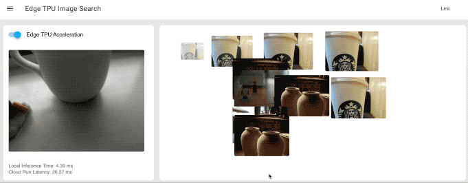

# coral-image-search
A fast similar image search using Edge TPU and Cloud Run.
Edge TPU extracts embedding features from camera image, then send the feature vector to the Cloud.
On Cloud Run, find closest feature vector from pre-computed spatial index.

## Prerequisites

### Hardware:
- USB Webcam or Coral Camera Module
- Coral USB Accelerator or Coral Dev Board

### Cloud:
You need to make an account and a project on [Google Cloud Platform](https://cloud.google.com/).

## Set up
This demo includes 3 parts;
1. Making image index and upload it to Cloud Storage,
2. Spatial search on Cloud Run, and
3. Realtime embedding extract on the Edge.  

To set up each parts, go to
1. `.Make_Index_and_Upload.ipynb`,
2. `/cloudrun`,
3. `/edge`

## How to use
Once you set up the above, run `server.py` described in `/edge` section.
